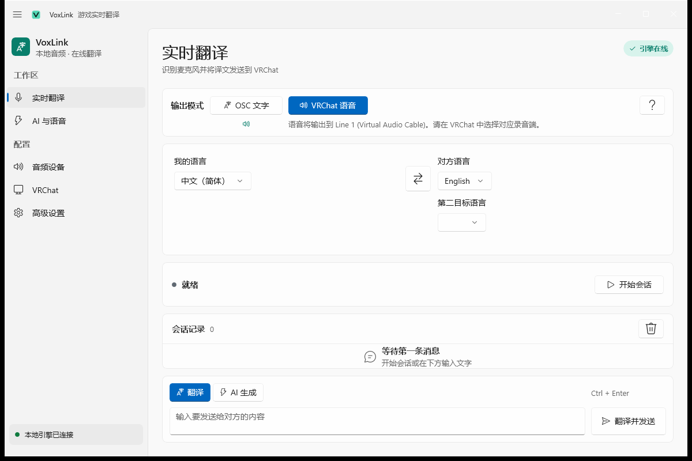

<div align="center">


# VoxLink

#### 面向 Windows 的双向实时语音翻译桌面应用，为 VRChat 等多人游戏设计

[](https://github.com/znc15/VoxLink/actions/workflows/ci.yml)
[](https://github.com/znc15/VoxLink/releases)
[](LICENSE)
[](https://github.com/znc15/VoxLink/releases)

[下载](https://github.com/znc15/VoxLink/releases) •
[架构说明](docs/architecture.md) •
[问题反馈](https://github.com/znc15/VoxLink/issues) •
[第三方声明](THIRD-PARTY-NOTICES.md)

</div>

实时翻译麦克风与系统语音，译文可写入 VRChat Chatbox 或经虚拟声卡送入游戏麦克风；默认可用本地 Whisper。

<div align="center">
    
</div>

## 特性

- **双向翻译**：麦克风与系统回环分路识别
- **运行模式**：`仅文字`（Chatbox）；`VRChat 语音`（TTS 经虚拟声卡输出）
- **识别**：本地 Whisper（tiny/base/small）或 DashScope、Soniox、SiliconFlow、MiMo、OpenAI 兼容接口
- **翻译**：免密翻译链路与可选 LLM 润色；支持第二目标语言（Chatbox 并列显示）
- **字幕**：桌面 overlay、可选 SteamVR；简体中文输出统一字形
- **说话人**：关 / 本地聚类 / 云端 speaker ID
- **VRChat**：Chatbox、MuteSelf 联动、启动时检查更新
- **凭据**：API Key 与自定义请求头经 DPAPI 存储
- **日志**：应用内查看，并写入磁盘

## 快速开始

自 [Releases](https://github.com/znc15/VoxLink/releases) 获取安装包或便携包：

| 类型 | 文件 | 说明 |
| --- | --- | --- |
| 安装包 | `Setup-VoxLink-x.x.x.exe` | 安装至 `%LOCALAPPDATA%\Programs\VoxLink`（当前用户，无需管理员） |
| 便携包 | `VoxLink-win-x64.zip` | 解压后运行 `VoxLink.exe` |

均含 .NET 运行时与 Windows App SDK。未代码签名，首次运行可能触发 SmartScreen。

> 默认仅采集麦克风，系统回环关闭，以免 TTS 回灌。需识别其他玩家语音时，在「音频设备」启用系统回环。

## 虚拟声卡（语音模式）

VRChat OSC 不承载音频，语音模式需第三方虚拟声卡：

1. 安装 [VB-CABLE](https://vb-audio.com/Cable/) 或 Voicemeeter
2. VoxLink「VRChat」页：「语音输出」选 `CABLE Input` 等播放设备
3. VRChat `Settings > Audio > Microphone`：选对应录音端（如 `CABLE Output`）

## 设置页

| 页面 | 内容 |
| --- | --- |
| 实时翻译 | 模式、语言、第二目标语言、最新消息、手动输入 |
| 会话记录 | 本次运行期间的全部实时翻译与手动输入 |
| AI 与语音 | 翻译 / 语音识别 / 语音输出开关与测试 |
| 音频设备 | 采集源、设备路由、断句 |
| VRChat | Chatbox、语音路由、MuteSelf、字幕 |
| 模型服务 | 翻译 / ASR / TTS 提供方、模型、凭据、本地 Whisper |
| 高级设置 | 会话、仅转写、出站朗读内容、说话人标签、快捷键、窗口外观 |
| 关于 | 版本、更新、运行状态 |
| 日志 | 运行日志 |

快捷键：`Ctrl+Alt+Space` 开始/停止，`Ctrl+Alt+Enter` 翻译当前输入。变更采集设备后需重新开始会话。

## 构建

环境：Windows 10 2004+ x64、.NET 10 SDK。

```bash
dotnet build VoxLink.slnx -c Release
dotnet test tests/VoxLink.Tests/VoxLink.Tests.csproj -c Release
```

依赖真实 Whisper / WASAPI / VRChat / SteamVR / 云服务的测试需 `VOXLINK_RUN_LIVE_TESTS=1`（默认 mock，无需 API Key）。

发布：

```bash
powershell.exe -NoProfile -ExecutionPolicy Bypass -File scripts/publish.ps1
```

输出目录 `artifacts/release/`（含 ZIP、安装包及校验和；首次执行会下载 Inno Setup 便携版）。

## 贡献

Issue 与 Pull Request 均可。较大改动请先开 Issue。

- 提交：`类型(范围): 描述`（feat / fix / docs / refactor / test / chore）
- 版本：有发布意义时更新 `src/VoxLink.UI/VoxLink.UI.csproj` 中的 `<Version>`
- 发布：标签 `vX.Y.Z` 触发 CI 构建 Release

## 技术栈

WinUI 3、Windows App SDK 2.3.1；独立 Engine（.NET 10、WASAPI、Whisper.net、sherpa-onnx、多路 ASR/翻译/TTS、VRChat OSC、OpenVR 字幕）。见 [docs/architecture.md](docs/architecture.md)。

## 限制

- 免密翻译与在线 TTS 无 SLA，受网络与配额影响
- 系统回环为混音，说话人 ID 无法对应 VRChat 用户名
- Chatbox 有长度与发送频率限制；语音模式依赖虚拟声卡，不经 OSC 传音频
- 桌面字幕为顶层窗口；头显字幕仅 SteamVR / OpenVR

## 许可证

[MIT License](LICENSE)。第三方组件见 [THIRD-PARTY-NOTICES.md](THIRD-PARTY-NOTICES.md)。
